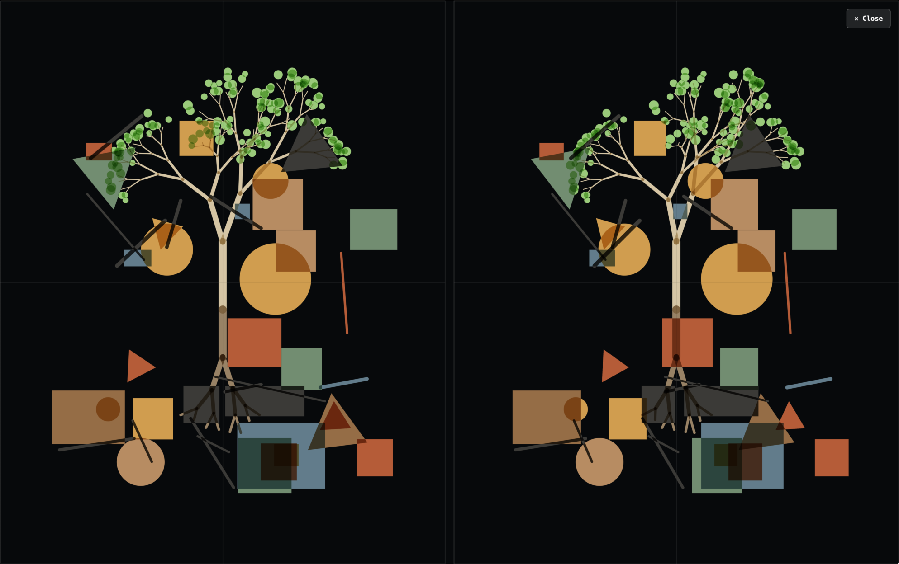

# BSC Lab Gallery

Selected, original captures of BSC Lab instruments and authored patches.
Gallery images are kept here beside their captions so that the repository—not
an external image host—remains the source of record.

Preserve captures as supplied: do not redraw, enhance, or replace them with a
generated approximation. Use descriptive, lowercase filenames and record the
instrument, view, and capture date in each caption.

## Patch Studio stereoscopic mix

Patch Studio's shared visual stage composing a tree scene with abstract forms
as a cross-eyed stereoscopic pair. Original capture, 8 August 2026.
